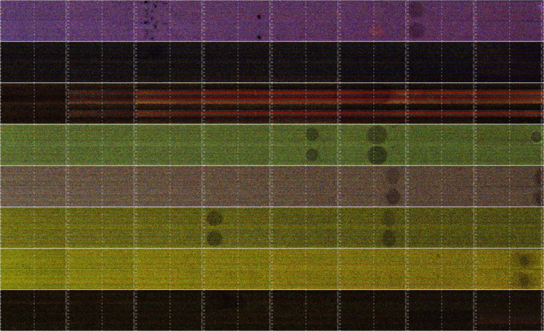
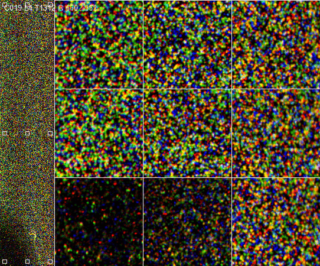

# Thumbnailpolish

***
## Purpose
This package contains scripts that generate color composite images 
from the diagnostic "Thumbnails" generated by Illumina (TM) sequencing
instruments.  There are slightly different recipes for compositing
thumbnail images for different models of instrument.

## Input 
This program first loops through a large number of black-and-white
images generated by the sequencing machine of "tiles" that represent
subsets of the flowcell image that are processed in batches.  A 2x101
run on an Illumina hiseq produces 96 tiles x 8 flow cells x 209 cycles
x 4 colors = 642,048 image files in 1672 directories.  

## Output
This tool builds false-color images of the four color channels and
then composities the color images of each tile into images of lanes, 
flowcells, and quicktime movies of the entire flowcell.

Examples of some of the output images are in the `img` directory.

## Videos
Videos of some of our sequencing runs from 2013 can be found on youtube 
1.  [Illumina flowcell visualizations](http://tinyurl.com/sequencingisbeautiful)
2.  [Illumina flowcell rag](http://tinyurl.com/illuminaflowcellrag)

And downloadable videos for teaching can be found here
[Flowcell directory](http://www.mcs.anl.gov/~trimble/flowcell)

## Prerequisites
This package depends on python, make, imagemagick, and libav.
The scripts at the moment require write access to the Thumbnails
directory or a copy of it.

## License
Thumbnail polish is under the BSD license; see LICENSE.
Distribution, modification and redistribution, incorporation
into other software, and pretty much everything else is allowed.

## Authors
*   Will Trimble (Argonne National Laboratory)

## Acknowledgements
The following people 
*   Sarah Owens (Argonne National Laboratory) (Hiseq and Miseq) 
*   Scott Tighe (University of Vermont) (Hiseq) 
*   Zach Herbert (Dana Farber Cancer Institute)  (Nextseq)
have provided data and have helped interpret billions upon billions of 
little colored spots.  

